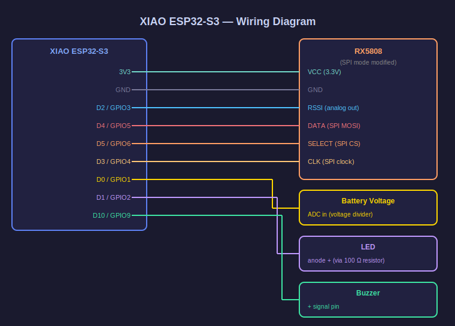
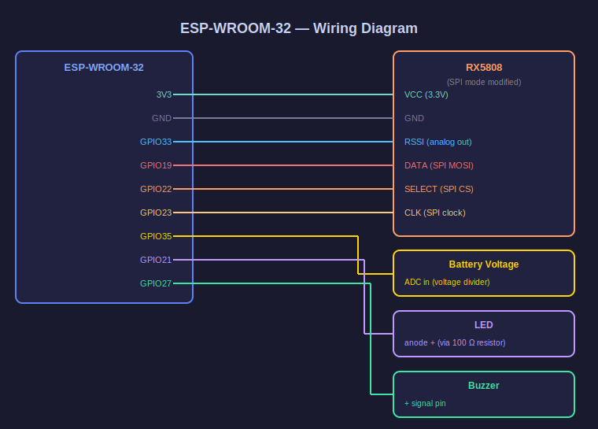

# PhobosLT 4ch

**4パイロット対応 FPVドローン ラップタイマー — RX5808 モジュール1個で4チャンネルを TDM スキャン**

🌐 [English](README.md) | [日本語](README.ja.md)

> [phobos-/PhobosLT](https://github.com/phobos-/PhobosLT)（シングルパイロット版）にインスパイアされたプロジェクト

---

## 概要

PhobosLT 4ch は、1つの RX5808 5.8GHz ビデオ受信モジュールを **TDM（時分割多重）スキャン**することで、最大4パイロットのラップタイムを同時計測するシステムです。

ESP32 の Wi-Fi アクセスポイント機能を使い、スマートフォンやタブレットのブラウザから設定・計測・結果確認をすべて行えます。

---

## 特徴

- **4パイロット同時計測** — RX5808 × 1個で実現
- **TDM ラウンドロビンスキャン** — 約 20ms 周期で全パイロットを均等スキャン
- **EMA フィルタ** — ラウンド間ノイズを平滑化（α=0.4 デフォルト）
- **3回平均 ADC 読み取り** — スロット内 ADC ノイズ低減
- **ドミナンスチェック** — 他パイロットの電波飽和による誤検知を防止
- **持続時間ガード** — 500ms 以上継続する環境電波をラップとして検知しない
- **Web UI** — レース管理・RSSI キャリブレーション・ラップ履歴をブラウザで操作
- **音声読み上げ** — ラップタイム自動アナウンス（Web Speech API）
- **カウントダウン＆ビープ音** — スタート合図（880Hz × 3 + 1320Hz GO!）
- **バッテリー電圧監視** — 低電圧アラート付き
- **ESP32 / XIAO ESP32-S3** 対応

---

## ハードウェア

### 必要なもの

| パーツ | 備考 |
|---|---|
| ESP-WROOM-32 または XIAO ESP32-S3 | 推奨：XIAO ESP32-S3 |
| RX5808 5.8GHz ビデオ受信モジュール | SPI モード改造済みのもの |
| ブザー（アクティブ or パッシブ） | 任意 |
| LED | 任意 |

### ピン配置

#### XIAO ESP32-S3（推奨）

| 機能 | XIAO ラベル | GPIO |
|---|---|---|
| RX5808 RSSI | D2 | 3 |
| RX5808 DATA (CH1) | D4 | 5 |
| RX5808 SELECT (CH2) | D5 | 6 |
| RX5808 CLOCK (CH3) | D3 | 4 |
| ブザー | D10 | 9 |
| LED | D1 | 2 |
| バッテリー電圧 | D0 | 1 |



#### ESP-WROOM-32

| 機能 | GPIO |
|---|---|
| RX5808 RSSI | 33 |
| RX5808 DATA (CH1) | 19 |
| RX5808 SELECT (CH2) | 22 |
| RX5808 CLOCK (CH3) | 23 |
| ブザー | 27 |
| LED | 21 |
| バッテリー電圧 | 35 |



---

## ビルド & 書き込み

### ツールチェーンのセットアップ

コンピュータにツールチェーンをセットアップするには、以下の手順を実行してください。

1. [**VS Code**](https://code.visualstudio.com/) をダウンロードしてインストールしてください。
2. VS Code を開き、左側のサイドバーにある Extensions アイコンをクリックします（**拡張機能の管理**を参照）。
3. 検索ボックスに `platformio` と入力し、拡張機能をインストールしてください（詳細は [PlatformIO インストールドキュメント](https://docs.platformio.org/en/latest/integration/ide/vscode.html) を参照してください）。
4. [**Git**](https://git-scm.com/) をインストールしてください。

### 書き込みコマンド

```bash
# ESP-WROOM-32：消去 → ファームウェア → ファイルシステム
pio run --target erase      --environment PhobosLT
pio run --target upload     --environment PhobosLT
pio run --target uploadfs   --environment PhobosLT

# XIAO ESP32-S3：消去 → ファームウェア → ファイルシステム
pio run --target erase      --environment ESP32S3
pio run --target upload     --environment ESP32S3
pio run --target uploadfs   --environment ESP32S3
```

---

## 使い方

1. ESP32 に書き込み後、Wi-Fi アクセスポイント **`PhobosLT`** に接続（パスワード：`phoboslt`）
2. ブラウザで `192.168.4.1` を開く
3. **設定タブ** でパイロット名・周波数・RSSI 閾値を設定
4. **キャリブタブ** でゲート付近の RSSI を確認しながら Enter/Exit しきい値を調整
5. **レースタブ** でスタート → 計測開始

### スクリーンショット

| レース | 設定 | キャリブ |
|---|---|---|
|  |  |  |

> スマートフォンのブラウザから PhobosLT アクセスポイントに接続して撮影。

### RSSI しきい値の目安

| 設定 | 説明 |
|---|---|
| Enter RSSI | ゲートに近づいたと判定する値（ピーク値より少し低めに設定） |
| Exit RSSI | ゲートを通過し終わったと判定する値（Enter より 10〜20 低く設定） |

---

## 計測アルゴリズム

```
アプローチ  : filteredRssi が Enter RSSI を超える → ピーク記録開始
ピーク      : filteredRssi が最大値を更新し続ける
出口        : filteredRssi が Exit RSSI を2連続で下回る → ラップ確定
ラップタイム: 前回ピーク時刻 → 今回ピーク時刻
```

**誤検知対策：**
- **ドミナンスチェック** — 自分の RSSI が他パイロットより DOMINANCE_DELTA(10) 以上高い場合のみ検知
- **持続時間ガード** — 500ms 以上 Enter RSSI 以上が続く場合は環境電波として無視
- **EMA フィルタ** — α=0.4 で TDM 周期間のノイズを平滑化

---

## チューニングパラメータ

| パラメータ | ファイル | デフォルト | 説明 |
|---|---|---|---|
| `SCAN_SETTLE_MS` | `src/main.cpp` | 5 | PLL セトル時間(ms) |
| `EMA_ALPHA` | `lib/LAPTIMER/laptimer.cpp` | 4 | EMA ゲイン (0〜10) |
| `DOMINANCE_DELTA` | `src/main.cpp` | 10 | ドミナンス判定マージン |
| `MAX_PEAK_DURATION_MS` | `lib/LAPTIMER/laptimer.cpp` | 500 | 持続時間ガード(ms) |
| `EXIT_CONFIRM_SAMPLES` | `lib/LAPTIMER/laptimer.cpp` | 2 | 出口確認サンプル数 |

---

## オリジナルとの違い

| | [phobos-/PhobosLT](https://github.com/phobos-/PhobosLT) | PhobosLT 4ch |
|---|---|---|
| パイロット数 | 1 | 4 |
| RX5808 | 1個・固定チャンネル | 1個・TDM 4ch |
| フィルタ | なし | EMA (α=0.4) |
| 誤検知対策 | なし | ドミナンス・持続時間ガード |
| Web UI | あり | 刷新（4パイロット対応） |
| 音声 | — | Web Speech API |

---

## ライセンス

MIT License — Copyright (c) 2025 yanazoo

---

## クレジット

- オリジナル設計：[phobos-/PhobosLT](https://github.com/phobos-/PhobosLT) — Copyright © 2023 Paweł Stefański (MIT License)
- 4ch TDM 実装：yanazoo
