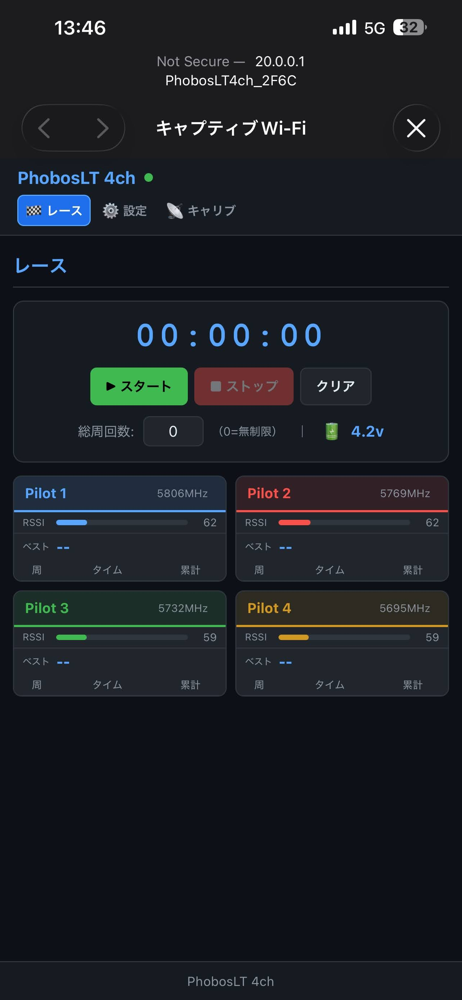
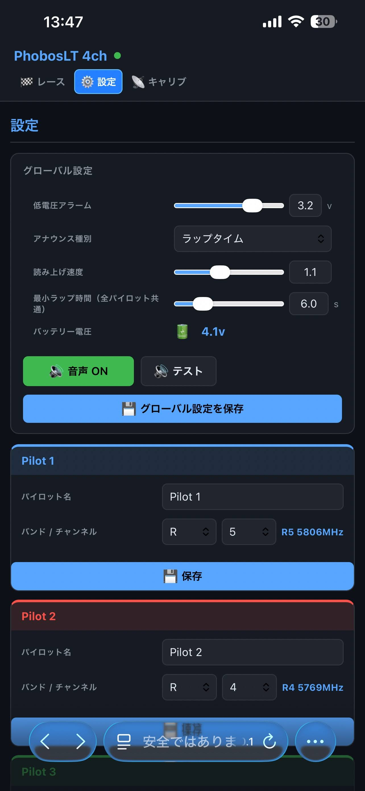
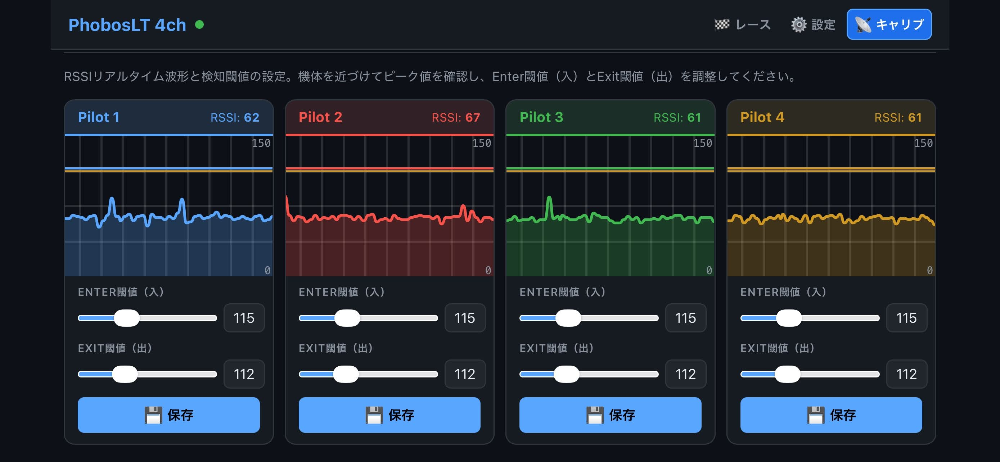

# PhobosLT 4ch

**4-channel FPV lap timer using a single ESP32 + RX5808 via Time Division Multiplexing (TDM)**

🌐 [English](README.md) | [日本語](README.ja.md)

> Inspired by [phobos-/PhobosLT](https://github.com/phobos-/PhobosLT) (single-pilot original)

---

## Overview

PhobosLT 4ch simultaneously measures lap times for up to 4 pilots using a single RX5808 5.8GHz video receiver module with **TDM (Time Division Multiplexing)** scanning.

The ESP32 acts as a Wi-Fi access point, providing a browser-based UI for configuration, race management, and results — accessible from any smartphone or tablet.

---

## Features

- **4-pilot simultaneous timing** — single RX5808 module
- **TDM round-robin scanning** — ~20ms cycle, all pilots scanned equally
- **EMA filter** — inter-round noise smoothing (α=0.4 default)
- **3-sample ADC averaging** — reduces in-slot ADC noise
- **Dominance check** — prevents false laps from RF saturation of nearby pilots
- **Duration guard** — rejects ambient RF signals sustained longer than 500ms
- **Web UI** — race management, RSSI calibration, lap history in browser
- **Voice announcements** — automatic lap time readout (Web Speech API)
- **Countdown & beep** — start signal (880Hz × 3 + 1320Hz GO!)
- **Battery voltage monitor** — low-voltage alert
- **ESP32 / XIAO ESP32-S3** support

---

## Hardware

### Requirements

| Part | Notes |
|---|---|
| ESP-WROOM-32 or XIAO ESP32-S3 | Recommended: XIAO ESP32-S3 |
| RX5808 5.8GHz video receiver | SPI-mode modified |
| Buzzer (active or passive) | Optional |
| LED | Optional |

### Pin Assignment

#### XIAO ESP32-S3 (recommended)

| Function | XIAO label | GPIO |
|---|---|---|
| RX5808 RSSI | D2 | 3 |
| RX5808 DATA (CH1) | D4 | 5 |
| RX5808 SELECT (CH2) | D5 | 6 |
| RX5808 CLOCK (CH3) | D3 | 4 |
| Buzzer | D10 | 9 |
| LED | D1 | 2 |
| Battery voltage | D0 | 1 |

#### ESP-WROOM-32

| Function | GPIO |
|---|---|
| RX5808 RSSI | 33 |
| RX5808 DATA (CH1) | 19 |
| RX5808 SELECT (CH2) | 22 |
| RX5808 CLOCK (CH3) | 23 |
| Buzzer | 27 |
| LED | 21 |
| Battery voltage | 35 |


---

## Build & Flash

### Toolchain Setup

To set up the toolchain on your computer, follow these steps:

1. Download and install [**VS Code**](https://code.visualstudio.com/).
2. Open VS Code and click the Extensions icon in the left sidebar (**Manage Extensions**).
3. Type `platformio` in the search box and install the extension (see the [PlatformIO install documentation](https://docs.platformio.org/en/latest/integration/ide/vscode.html) for details).
4. Install [**Git**](https://github.com/git-guides/install-git).

### Flash Commands

```bash
# ESP-WROOM-32: erase → firmware → filesystem
pio run --target erase      --environment PhobosLT
pio run --target upload     --environment PhobosLT
pio run --target uploadfs   --environment PhobosLT

# XIAO ESP32-S3: erase → firmware → filesystem
pio run --target erase      --environment ESP32S3
pio run --target upload     --environment ESP32S3
pio run --target uploadfs   --environment ESP32S3
```

---

## Usage

1. After flashing, connect to Wi-Fi AP **`PhobosLT`** (password: `phoboslt`)
2. Open `192.168.4.1` in your browser
3. **Settings tab** — set pilot names, frequencies, RSSI thresholds
4. **Calib tab** — adjust Enter/Exit RSSI thresholds while watching live RSSI near the gate
5. **Race tab** — press Start and begin timing

### Screenshots

| Race | Settings | Calibration |
|---|---|---|
|  |  |  |

> Screenshots taken from a smartphone browser connected to the PhobosLT access point.

### RSSI Threshold Guide

| Setting | Description |
|---|---|
| Enter RSSI | Threshold to detect gate approach (set slightly below peak value) |
| Exit RSSI | Threshold to confirm gate exit (set 10–20 below Enter RSSI) |

---

## Detection Algorithm

```
Approach : filteredRssi crosses Enter RSSI → start peak capture
Peak     : filteredRssi continues to update maximum
Exit     : filteredRssi drops below Exit RSSI for 2 consecutive samples → lap recorded
Lap time : previous peak timestamp → current peak timestamp
```

**False detection prevention:**
- **Dominance check** — only triggers when this pilot's RSSI exceeds all others by DOMINANCE_DELTA (10)
- **Duration guard** — rejects signals staying above Enter RSSI for more than 500ms (ambient RF)
- **EMA filter** — α=0.4 smooths noise across the 20ms TDM gap

---

## Tuning Parameters

| Parameter | File | Default | Description |
|---|---|---|---|
| `SCAN_SETTLE_MS` | `src/main.cpp` | 5 | PLL settle time (ms) |
| `EMA_ALPHA` | `lib/LAPTIMER/laptimer.cpp` | 4 | EMA gain (0–10) |
| `DOMINANCE_DELTA` | `src/main.cpp` | 10 | Dominance margin |
| `MAX_PEAK_DURATION_MS` | `lib/LAPTIMER/laptimer.cpp` | 500 | Duration guard (ms) |
| `EXIT_CONFIRM_SAMPLES` | `lib/LAPTIMER/laptimer.cpp` | 2 | Exit confirmation samples |

---

## Differences from Original

| | [phobos-/PhobosLT](https://github.com/phobos-/PhobosLT) | PhobosLT 4ch |
|---|---|---|
| Pilots | 1 | 4 |
| RX5808 | 1 module, fixed channel | 1 module, TDM 4ch |
| Filter | None | EMA (α=0.4) |
| False detection prevention | None | Dominance check + duration guard |
| Web UI | Yes | Redesigned for 4 pilots |
| Voice | — | Web Speech API |

---

## License

MIT License — Copyright (c) 2025 yanazoo

---

## Credits

- Original design: [phobos-/PhobosLT](https://github.com/phobos-/PhobosLT) — Copyright © 2023 Paweł Stefański (MIT License)
- 4ch TDM implementation: yanazoo
